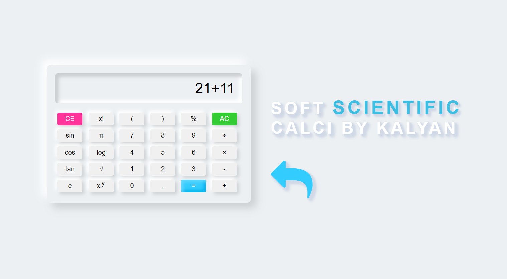

# Nemorphism Calculator



The Nemorphism Calculator is a sleek and user-friendly calculator application developed using HTML, CSS, and JavaScript. It implements the emerging design trend of Neumorphism, combining elements of flat design and skeuomorphism to create a modern and visually appealing user interface.

## Features

- Basic arithmetic operations: Addition, subtraction, multiplication, and division.
- Clear button: Clears the calculator display and resets the calculation.
- Backspace button: Deletes the last entered digit or operator.
- Keyboard support: Allows users to enter calculations using both the calculator buttons and their computer keyboard.

## Installation

To use the Nemorphism Calculator locally, follow these steps:

1. Clone the repository:

   ```shell
   git clone https://github.com/your-username/nemorphism-calculator.git
   ```

2. Open the project directory:

   ```shell
   cd nemorphism-calculator
   ```

3. Open the `index.html` file in your preferred web browser.

## Usage

Once the calculator is loaded in your web browser, you can perform calculations using the following methods:

- Click the calculator buttons to enter digits, operators, or perform specific functions.
- Use your computer keyboard to enter calculations, with the following keyboard shortcuts:
  - Digits: 0-9
  - Operators: +, -, \*, /
  - Enter/Equals: Enter or Return key
  - Clear: Esc key
  - Backspace: Backspace or Delete key

## Contributing

Contributions to the Nemorphism Calculator project are welcome and encouraged! To contribute, follow these steps:

1. Fork the repository.
2. Create a new branch: `git checkout -b my-new-branch`.
3. Make your changes and commit them: `git commit -m 'Add some feature'`.
4. Push to the branch: `git push origin my-new-branch`.
5. Submit a pull request detailing your changes and their benefits.

## License

The Nemorphism Calculator project is licensed under the [MIT License](LICENSE).

## Acknowledgements

- The calculator design and concept were inspired by the Neumorphism design trend.
- [Bootstrap](https://getbootstrap.com/) - Used for basic styling and responsive layout.
- [Font Awesome](https://fontawesome.com/) - Used for calculator icon.
- [Google Fonts](https://fonts.google.com/) - Used for the calculator display font.

## Contact

For any questions, suggestions, or feedback, please feel free to reach out to me:

- Email:pallelakalyan20@.com
- GitHub: PallelaKalyan(https://github.com/Pallelakalyan)

---

